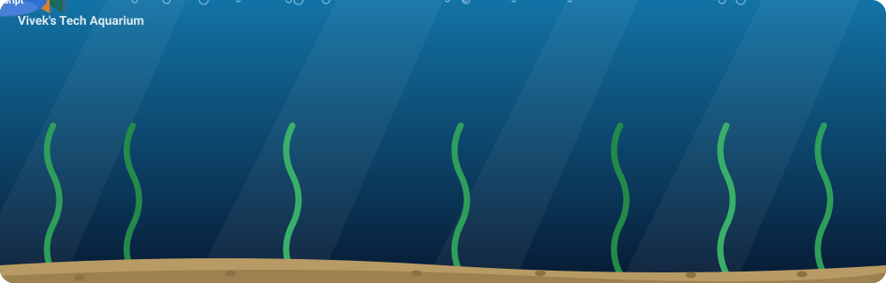
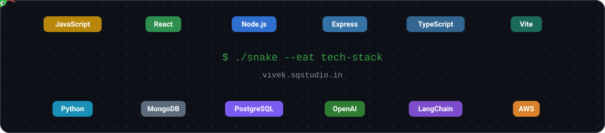

<div align="center">




<p>
  <b>Software Engineer | Full-Stack Developer | AI &amp; LLM Enthusiast | Cloud &amp; AWS | DevOps | Startup Builder</b><br />
  Building scalable web applications, AI-powered products &amp; innovative digital solutions.
</p>

<p>
  <a href="https://vivek.sqstudio.in"></a>
  <a href="https://www.linkedin.com/in/vivekprajapati4864"></a>
  <a href="mailto:vkpn2006@gmail.com"></a>
</p>

<p>
  
  <a href="https://github.com/Vivekp2006?tab=followers"></a>
  
</p>


</div>

## 🎯 Recruiter Snapshot

| | |
| :--- | :--- |
| **Looking for** | Software Engineer · Full-Stack Developer · AI / LLM Engineer roles |
| **Core skills** | JavaScript, React, Node.js, Python, LLM apps, RAG, LangChain, MongoDB, PostgreSQL, MySQL, AWS, Google Cloud |
| **Current roles** | Founder, [MakeTheStartup.com](https://makethestartup.com) · Tech Team Lead, SemiQuantum · DBA, E-Cell Sharda · Core Tech Team, [ONC Sharda](https://onc.shardatech.org) |
| **Experience** | AI & Automation Intern (Aug – Oct 2025) · Web Development Intern (Jun – Jul 2026) |
| **Live products** | [MakeTheStartup.com](https://makethestartup.com) · [SachBol](https://sachbol.tech) · [ApnaStore](https://apnasstore.com) |
| **Education** | B.Tech, Computer Science, Sharda University (2024 – Present) |
| **Portfolio** | [vivek.sqstudio.in](https://vivek.sqstudio.in) |
| **Contact** | [vkpn2006@gmail.com](mailto:vkpn2006@gmail.com) |

<div align="center">
  
</div>

## 👋 About Me

I'm **Vivek Kumar Prajapati**, a Computer Science undergraduate and full-stack developer who enjoys turning ideas into working products. My work sits at the intersection of **web development**, **AI / LLM applications**, **automation**, and **startups**.

- Founder of **[MakeTheStartup.com](https://makethestartup.com)**.
- Tech Team Lead at **SemiQuantum**, building AI tools and technical solutions.
- Database Administrator (DBA) at **E-Cell Sharda** and core tech team member at **[ONC Sharda](https://onc.shardatech.org)**.
- Experience building full-stack platforms with authentication, admin dashboards, REST APIs, and payment integrations.
- Hands-on with the OpenAI API, RAG systems, and LangChain: chat agents, prompt engineering workflows, and fine-tuning experiments.
- Comfortable with cloud (AWS, Google Cloud) and SQL databases (MySQL, PostgreSQL).
- Interested in SaaS products and developer tools.

```text
$ whoami
vivek — full-stack dev · ai/llm builder · startup builder

$ cat interests.txt
web development · ai / llm apps · software engineering
automation · startups · saas · developer tools
```

<div align="center">
  
</div>

## 🛠️ Tech Stack

| Category | Technologies |
| :--- | :--- |
| **Languages** |      |
| **Frontend** |     |
| **Backend** |    |
| **Database** |      |
| **AI / LLM** |        |
| **Tools** |     |
| **Deployment** |      |

<div align="center">
  
</div>

## 🎮 Developer Profile

<div align="center">

| 🧑‍💻 Player Card | |
| :--- | :--- |
| **Class** | Full-Stack Developer |
| **Specialization** | AI / LLM Applications |
| **Guild** | SemiQuantum (Tech Team Lead) |
| **Main Weapons** | JavaScript · React · Node.js · MongoDB · PostgreSQL · OpenAI API · LangChain |
| **Home Base** | Sharda University: B.Tech, Computer Science (2024 – Present) |
| **Current Quest** | Building products and shipping them live |

</div>

### 💼 Current Roles

| Role | Where |
| :--- | :--- |
| **Founder** | [MakeTheStartup.com](https://makethestartup.com) |
| **Tech Team Lead** | SemiQuantum |
| **Database Administrator (DBA)** | E-Cell Sharda |
| **Core Tech Team Member** | [ONC Sharda](https://onc.shardatech.org) |

### 🏆 Achievements Unlocked

| Badge | Achievement | Description |
| :---: | :--- | :--- |
| 🚀 | **Launch Day** | Launched multiple live platforms, including [SachBol](https://sachbol.tech), ApnaStore ([apnasstore.com](https://apnasstore.com)), and SemiQuantum. |
| 🤖 | **Automation Architect** | Built AI-powered automation systems, including an Instagram auto-reply bot. |
| 🏗️ | **Founder Mode** | Founder of [MakeTheStartup.com](https://makethestartup.com). |
| 🧪 | **Prompt Alchemist** | Prompt engineering workflows and fine-tuning experiments with the OpenAI API. |

### 🗺️ Quest Log

| When | Quest |
| :--- | :--- |
| **Present** | Tech Team Lead at SemiQuantum · DBA at E-Cell Sharda · Core tech team member at ONC Sharda |
| **Aug 2024 – Present** | B.Tech in Computer Science at Sharda University, Greater Noida |
| **Aug 2025 – Oct 2025** | AI & Automation Intern at SemiQuantum Technologies: AI integrations, prompt engineering workflows, API-based AI agents |
| **Jun 2026 – Jul 2026** | Web Development Intern at SemiQuantum Technologies: full-stack platforms, REST APIs, authentication, admin dashboards, Vercel deployments |

<div align="center">
  
</div>

## ⭐ Featured Projects

<table>
  <tr>
    <td width="50%" valign="top">
      <b><a href="https://github.com/semiquantum/sqstudio.in">sqstudio.in</a></b><br />
      Repository I worked on as part of my development and project work.
    </td>
    <td width="50%" valign="top">
      <b><a href="https://github.com/Vivekp2006/makethestartup">makethestartup</a></b><br />
      Repository I worked on as part of my development and project work.
    </td>
  </tr>
  <tr>
    <td width="50%" valign="top">
      <b><a href="https://github.com/semiquantum/SachBol">SachBol</a></b><br />
      Anonymous social platform with posts, polls, rooms, AI-based content moderation, and a reputation system.
    </td>
    <td width="50%" valign="top">
      <b><a href="https://github.com/semiquantum/SemiVerse">SemiVerse</a></b><br />
      Repository I worked on as part of my development and project work.
    </td>
  </tr>
  <tr>
    <td width="50%" valign="top">
      <b><a href="https://github.com/semiquantum/skilliant">skilliant</a></b><br />
      Repository I worked on as part of my development and project work.
    </td>
    <td width="50%" valign="top">
      <b><a href="https://github.com/semiquantum/prajapatielectrical">prajapatielectrical</a></b><br />
      Repository I worked on as part of my development and project work.
    </td>
  </tr>
  <tr>
    <td width="50%" valign="top">
      <b><a href="https://github.com/Vivekp2006/Law_LMM">Law_LMM</a></b><br />
      Repository I worked on as part of my development and project work.
    </td>
    <td width="50%" valign="top">
      <b><a href="https://github.com/Vivekp2006/SQ-InnovateX">SQ-InnovateX</a></b><br />
      Repository I worked on as part of my development and project work.
    </td>
  </tr>
</table>

<div align="center">
  
</div>

## 🤖 AI / LLM Projects

| Repository | Description |
| :--- | :--- |
| [bot](https://github.com/semiquantum/bot) | AI / LLM-related project repository. |
| [chatbot](https://github.com/semiquantum/chatbot) | AI / LLM-related project repository. |
| [wpbot](https://github.com/semiquantum/wpbot) | AI / LLM-related project repository. |
| [bott](https://github.com/Vivekp2006/bott) | AI / LLM-related project repository. |
| [Law_LMM](https://github.com/Vivekp2006/Law_LMM) | AI / LLM-related project repository. |
| [SemiVerse](https://github.com/semiquantum/SemiVerse) | AI / LLM-related project repository. |
| [typeverse](https://github.com/semiquantum/typeverse) | AI / LLM-related project repository. |

<div align="center">
  
</div>

## 🚀 Startup / Product Projects

| Repository | Description |
| :--- | :--- |
| [makethestartup](https://github.com/Vivekp2006/makethestartup) | Repository I worked on as part of my development and project work. |
| [growzone](https://github.com/semiquantum/growzone) | Startup-support AI platform: startup guidance, business plan generation, and personalized sessions. |
| [SQ-InnovateX](https://github.com/semiquantum/SQ-InnovateX) | Repository I worked on as part of my development and project work. |
| [prajapatielectrical](https://github.com/semiquantum/prajapatielectrical) | Repository I worked on as part of my development and project work. |
| [prajapatielectrical01](https://github.com/semiquantum/prajapatielectrical01) | Repository I worked on as part of my development and project work. |
| [sqstudio.in](https://github.com/semiquantum/sqstudio.in) | Repository I worked on as part of my development and project work. |
| [sqstudio](https://github.com/semiquantum/sqstudio) | Repository I worked on as part of my development and project work. |
| [xtrapo](https://github.com/vivkumar4864/xtrapo) | Repository I worked on as part of my development and project work. |
| [skilliant](https://github.com/semiquantum/skilliant) | Repository I worked on as part of my development and project work. |

<div align="center">
  
</div>

## 💻 Development / Programming Projects

| Repository | Description |
| :--- | :--- |
| [Java](https://github.com/Vivekp2006/Java) | Repository I worked on as part of my development and project work. |
| [Proxy-Simulator](https://github.com/Vivekp2006/Proxy-Simulator) | Repository I worked on as part of my development and project work. |
| [Go-COCO](https://github.com/Vivekp2006/Go-COCO) | Repository I worked on as part of my development and project work. |
| [fluttertest](https://github.com/Vivekp2006/fluttertest) | Repository I worked on as part of my development and project work. |
| [Chat](https://github.com/Vivekp2006/Chat) | Repository I worked on as part of my development and project work. |
| [ONC_WEB](https://github.com/Vivekp2006/ONC_WEB) | Repository I worked on as part of my development and project work. |
| [onc_2006](https://github.com/Vivekp2006/onc_2006) | Repository I worked on as part of my development and project work. |
| [VarshX](https://github.com/Vivekp2006/VarshX) | Repository I worked on as part of my development and project work. |
| [GuruCode](https://github.com/semiquantum/GuruCode) | Repository I worked on as part of my development and project work. |

<div align="center">
  
</div>

## 🎓 Education / School / Community Projects

| Repository | Description |
| :--- | :--- |
| [Ecell](https://github.com/Vivekp2006/Ecell) | Repository I worked on as part of my development and project work. |
| [School](https://github.com/vivkumar4864/School) | Repository I worked on as part of my development and project work. |
| [raghubirschool](https://github.com/vivkumar4864/raghubirschool) | Repository I worked on as part of my development and project work. |
| [SQ-APEX](https://github.com/semiquantum/SQ-APEX) | SQ Apex web platform, built during my Web Development internship at SemiQuantum Technologies. |

<div align="center">
  
</div>

## 🤝 Collaboration

I've also collaborated with other developers on **10+ repositories** across web, app, and product projects.

<div align="center">
  
</div>

## 📂 Complete Repository Directory

<details>
<summary>📂 View Complete Repository List</summary>

<br />

1. [sqstudio.in](https://github.com/semiquantum/sqstudio.in)
2. [makethestartup](https://github.com/Vivekp2006/makethestartup)
3. [SachBol](https://github.com/semiquantum/SachBol)
4. [raghubirschool](https://github.com/vivkumar4864/raghubirschool)
5. [SemiVerse](https://github.com/semiquantum/SemiVerse)
6. [bot](https://github.com/semiquantum/bot)
7. [typeverse](https://github.com/semiquantum/typeverse)
8. [semivarsh](https://github.com/vivkumar4864/semivarsh)
9. [prajapatielectrical](https://github.com/semiquantum/prajapatielectrical)
10. [GuruCode](https://github.com/semiquantum/GuruCode)
11. [skilliant](https://github.com/semiquantum/skilliant)
12. [bott](https://github.com/Vivekp2006/bott)
13. [SQ-InnovateX](https://github.com/semiquantum/SQ-InnovateX)
14. [sqstudio](https://github.com/semiquantum/sqstudio)
15. [Ecell](https://github.com/Vivekp2006/Ecell)
16. [School](https://github.com/vivkumar4864/School)
17. [Apppointment](https://github.com/semiquantum/Apppointment)
18. [SQ-APEX](https://github.com/SEMIQUANTUM-TECHNOLOGIES/SQ-APEX)
19. [growzone](https://github.com/semiquantum/growzone)
20. [Java](https://github.com/Vivekp2006/Java)
21. [Proxy-Simulator](https://github.com/Vivekp2006/Proxy-Simulator)
22. [Go-COCO](https://github.com/Vivekp2006/Go-COCO)
23. [Law_LMM](https://github.com/Vivekp2006/Law_LMM)
24. [xtrapo](https://github.com/vivkumar4864/xtrapo)
25. [prajapatielectrical01](https://github.com/semiquantum/prajapatielectrical01)
26. [wpbot](https://github.com/semiquantum/wpbot)
27. [fluttertest](https://github.com/Vivekp2006/fluttertest)
28. [chatbot](https://github.com/semiquantum/chatbot)
29. [SachBol](https://github.com/Vivekp2006/SachBol)
30. [VarshX](https://github.com/Vivekp2006/VarshX)
31. [Chat](https://github.com/Vivekp2006/Chat)
32. [ONC_WEB](https://github.com/Vivekp2006/ONC_WEB)
33. [onc_2006](https://github.com/Vivekp2006/onc_2006)

</details>

<div align="center">
  
</div>

## 🕹️ Play Around

### 🐟 Tech Aquarium

<div align="center">
  
  <br />
  <sub>Every fish is a technology I work with.</sub>
</div>

### 🐍 Snake Eats My Tech Stack

<div align="center">
  
  <br /><br />
  <a href="https://vivekp2006.github.io/Vivekp2006/play.html"></a>
</div>

### 🧩 Mini Challenges

<details>
<summary><b>🧠 Guess the Output</b> (JavaScript edition)</summary>

<br />

Think first, then open each answer.

**1.** What does this print?

```javascript
console.log(0.1 + 0.2 === 0.3);
```

<details>
<summary>Reveal answer</summary>

`false`. Floating-point math gives `0.30000000000000004`. Compare with a tolerance (for example `Math.abs(a - b) < Number.EPSILON`) instead.

</details>

**2.** What does this print?

```javascript
console.log(typeof null);
```

<details>
<summary>Reveal answer</summary>

`"object"`. This is a long-standing quirk of JavaScript, kept for backward compatibility.

</details>

**3.** What does this print?

```javascript
console.log([] + []);
```

<details>
<summary>Reveal answer</summary>

An empty string. Both arrays convert to `""` and get concatenated.

</details>

</details>

<details>
<summary><b>🎲 Two Truths and a Lie</b></summary>

<br />

Which one is the lie?

1. I founded SemiQuantum.
2. I've built AI chat agents using the OpenAI API.
3. I've deployed production code to the Moon.

<details>
<summary>Reveal the lie</summary>

**Number 3.** Everything I've shipped so far runs on Earth (mostly on Vercel).

</details>

</details>

<details>
<summary><b>🔐 Secret Level</b></summary>

<br />

```text
> you found the hidden level
> reward unlocked: a coffee chat
> say hi at vkpn2006@gmail.com
```

</details>

<div align="center">
  
</div>

## 📊 GitHub Statistics

<div align="center">

<picture>
  <source media="(prefers-color-scheme: dark)" srcset="https://github-readme-stats.vercel.app/api?username=Vivekp2006&amp;show_icons=true&amp;hide_border=true&amp;theme=transparent&amp;title_color=58a6ff&amp;text_color=c9d1d9&amp;icon_color=58a6ff" />
  <source media="(prefers-color-scheme: light)" srcset="https://github-readme-stats.vercel.app/api?username=Vivekp2006&amp;show_icons=true&amp;hide_border=true&amp;theme=transparent&amp;title_color=0969da&amp;text_color=24292f&amp;icon_color=0969da" />
  
</picture>
<picture>
  <source media="(prefers-color-scheme: dark)" srcset="https://github-readme-stats.vercel.app/api/top-langs/?username=Vivekp2006&amp;layout=compact&amp;hide_border=true&amp;theme=transparent&amp;title_color=58a6ff&amp;text_color=c9d1d9" />
  <source media="(prefers-color-scheme: light)" srcset="https://github-readme-stats.vercel.app/api/top-langs/?username=Vivekp2006&amp;layout=compact&amp;hide_border=true&amp;theme=transparent&amp;title_color=0969da&amp;text_color=24292f" />
  
</picture>

<br />

<picture>
  <source media="(prefers-color-scheme: dark)" srcset="https://github-readme-streak-stats.herokuapp.com/?user=Vivekp2006&amp;theme=transparent&amp;hide_border=true&amp;ring=58a6ff&amp;fire=f78166&amp;currStreakNum=58a6ff&amp;currStreakLabel=58a6ff&amp;sideNums=c9d1d9&amp;sideLabels=8b949e&amp;dates=8b949e" />
  <source media="(prefers-color-scheme: light)" srcset="https://github-readme-streak-stats.herokuapp.com/?user=Vivekp2006&amp;theme=transparent&amp;hide_border=true&amp;ring=0969da&amp;fire=fb8500&amp;currStreakNum=0969da&amp;currStreakLabel=0969da&amp;sideNums=24292f&amp;sideLabels=57606a&amp;dates=57606a" />
  
</picture>

</div>

<div align="center">
  
</div>

## 📬 Connect With Me

<div align="center">

<a href="https://vivek.sqstudio.in"></a>
<a href="https://www.linkedin.com/in/vivekprajapati4864"></a>
<a href="https://github.com/Vivekp2006"></a>
<a href="mailto:vkpn2006@gmail.com"></a>

</div>

<div align="center">
  
</div>

<div align="center">
  
  <br />
  <sub>Thanks for stopping by. Let's build something together.</sub>
</div>
